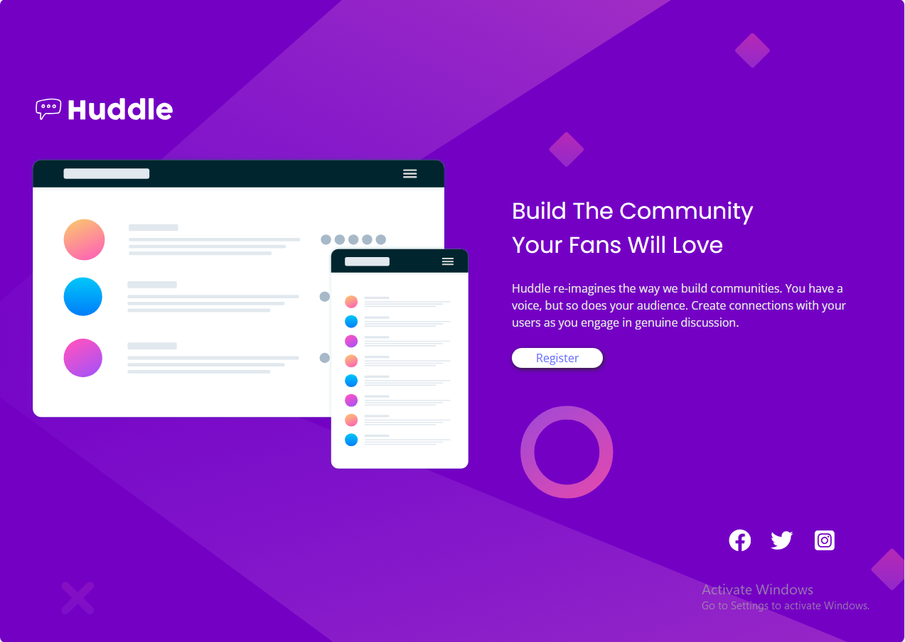

# 🚀 Huddle Landing Page

<div align="center">
  
</div>

A responsive landing page for Huddle, built with React, Tailwind CSS, and Vite. Perfect for showcasing community-building platforms.

## 📸 Preview


## ✨ Features

- **Mobile-first design**: Fully responsive on all devices.
- **Interactive elements**: Hover effects on buttons and social icons.
- **Optimized performance**: Lazy-loaded images and modern build tools.
- **SEO-ready**: Includes meta tags for better search engine visibility.

## 🛠️ Technologies Used

- React 18
- Tailwind CSS 3
- Vite 4
- React Icons

## 📦 Installation & Setup
1. **Clone the repository**:
```bash
git clone https://github.com/AbdulrahmanFrontend/huddle-landing-abdulrahman
cd huddle-landing-page
```
2. **Install dependencies**:
```bash
npm install
```
3. **Run the development server**:
```bash
npm run dev
```
4. **Open http://localhost:5173/ to view in browser**.

## 🌐 Deployment
Option 1: Netlify (Recommended)
1. Drag & drop the (build) folder to [Netlify Drop](https://app.netlify.com/drop).
2. Your site will be live instantly!

Option 2: Vercel
1. Import the project directly from your GitHub repository on [Vercel](https://vercel.com/new).

## 📂 Project Structure
```text
huddle-landing-page/          (Root folder)
├── build/                    (Production build - auto-generated)
│   ├── assets/               (Compiled JS/CSS)
│   ├── images/               (Optimized images)
│   └── index.html            (Production entry point)
│
├── public/                   (Static files)
│   └── images/               (Original image assets)
│       ├── logo.svg
│       ├── illustration-mockups.svg
│       ├── bg-desktop.svg
│       └── bg-mobile.svg
│
├── src/                      (Source code)
│   ├── App.css               (Custom Tailwind styles)
│   ├── App.jsx               (Main component)
│   └── data/
│       └── content.js        (Text/content configuration)
│
├── docs/                     (Optional documentation)
│   ├── User_Guide.md         (Detailed usage instructions)
│   └── User_Guide.pdf        (PDF version for non-tech clients)
│
├── README.md                 (Essential project overview - REQUIRED)
├── index.html                (Entry point)
└── vite.config.js            (Build configuration)
```

## 🎨 Customization
Edit (content.js) to modify:
- Text content (title, description)
- Social media links
- Image paths

## 🔍 SEO Optimization
The project includes:
- Semantic HTML5
- Meta tags (description, OG tags)
- Lazy-loaded images

## 🤝 Contributing
Pull requests are welcome! For major changes, please open an issue first.

## 📄 License
[MIT](LICENSE) © [Abdulrahman]